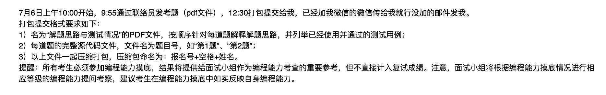
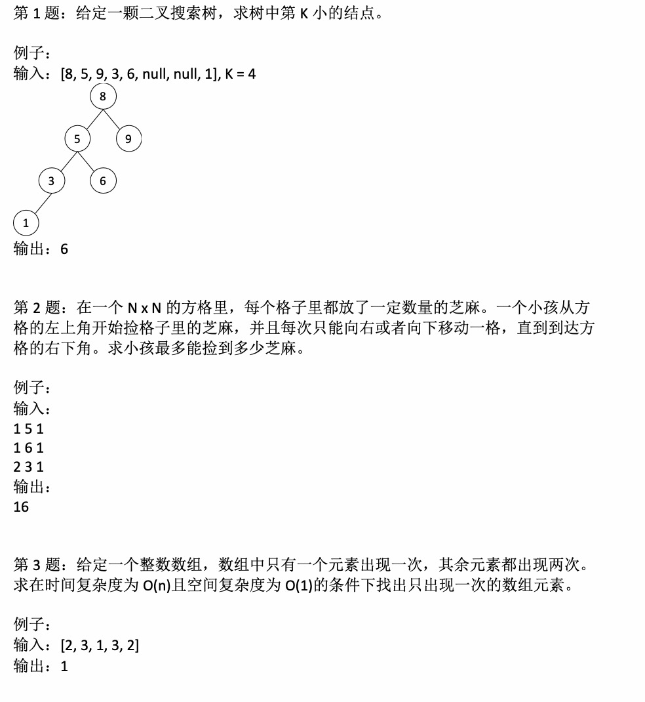

# 任务要求





提交文档使用Typora直接将Markdown生成PDF即可！


# 第一题

## 解题思路

进行BST的中序遍历即可，使用非递归方法可以提高效率。


## 核心代码

```cpp
int kthSmallest(TreeNode* root, int k) {
    stack<TreeNode*> s;
    while (root || !s.empty()) {
        if (root) {
            s.push(root);
            root = root->left;
        } else {
            root = s.top();
            s.pop();
            if (--k == 0) {
                return root->value;
            }
            root = root->right;
        }
    }
    return -1;
}


## 测试用例

已通过样例测试和逻辑检查。


# 第二题

## 解题思路

这是一道经典的二维动态规划问题，可以递推求解。

题意要求从左上角到右下角进行芝麻粒的拾取，代表递推的方向是从左上到右下的。

题意要求每次只能向右或向下移动一格，反过来看，这意味着，每一个位置取到芝麻粒只能来自于左边或上边，相加即代表取到。

由于要取最大值，所以需要进行max()处理，保证芝麻粒取的是左边和上边的最大值，递推即得全局最大值。

写出状态转移方程为：`dp[i][j] = dp[i][j] + max(dp[i-1][j], dp[i][j-1])`

数组问题要注意边界值，这种问题有两种求解方法：

1. 为整个N×N数组多开一个边界，即(N+2)×(N+2)的数组，边界值赋为0，确保不会越界。
2. 为边界值进行特殊处理，再对整体数据进行处理。

在本题的求解中，我选择了第二种策略，节约空间开销，也导致编码略显臃肿。

最后输出`dp[n-1][n-1]`即为所求。


## 核心代码

```cpp
int f(vector<vector<int>>& graph) {
    int n = graph.size();
    vector<vector<int>> dp(n, vector<int>(n,0));
    for (int i = 0; i < n; i++) {
        for (int j = 0; j < n; j++) {
            dp[i][j] = graph[i][j];
        }
    }
    dp[0][0] = graph[0][0];
    for (int i = 1; i < n; i++) {
        dp[0][i] += dp[0][i-1];
        dp[i][0] += dp[i-1][0];
    }
    for (int i = 1; i < n; i++) {
        for (int j = 1; j < n; j++) {
            dp[i][j] += max(dp[i-1][j], dp[i][j-1]);
        }
    }
    return dp[n-1][n-1];
}
```


完整代码见程序文件。


## 测试用例

已通过样例测试和逻辑检查。


# 第三题

## 解题思路

对于这类题，简单粗暴的解法是构建一个便于查找的map或set结构，并进行统计。

但存储数据，势必造成额外的空间开销，势必不能达到O(1)的空间复杂度，所以需要使用特殊方法进行原地求解。

原地求解的经典方法是位运算，位运算中最经典的符号是异或。

异或位运算的作用通常有：

- 实现两个值的交换，而不必使用临时变量（尽管实际可能更慢）。代码是`a=a^b; b=b^a; a=a^b;`
- 使某些特定的位翻转。例如，对数10100001的第2位和第3位翻转，则可以将该数与00000110进行按位异或运算。
- ……

很多算法题都可以使用异或位运算进行妙解。

本题利用了异或运算的以下三个性质：

1. 任何数和0做异或运算，结果仍然是原来的数。

2. 任何数和其自身做异或运算，结果是0。

3. 异或运算满足交换律和结合律。

由于满足结合律和交换律，所以可以交换顺序并合并，而所有重复的两个数都可以异或得0。

由于任何数和0做异或运算，结果仍是原来的数，所以所有的0互相异或可以得到0，再与唯一的数异或，得到的就是那个数。

所以，只需要将所有的数逐一异或，即得结果。

如此，我就找到了唯一的数。


## 核心代码

```cpp
int singleNumber(vector<int>& nums) {
    int result = 0;
    for (int i : nums) {
        result ^= i;
    }
    return result;
}
```


完整代码见程序文件。


## 测试用例

已通过样例测试和逻辑检查。


